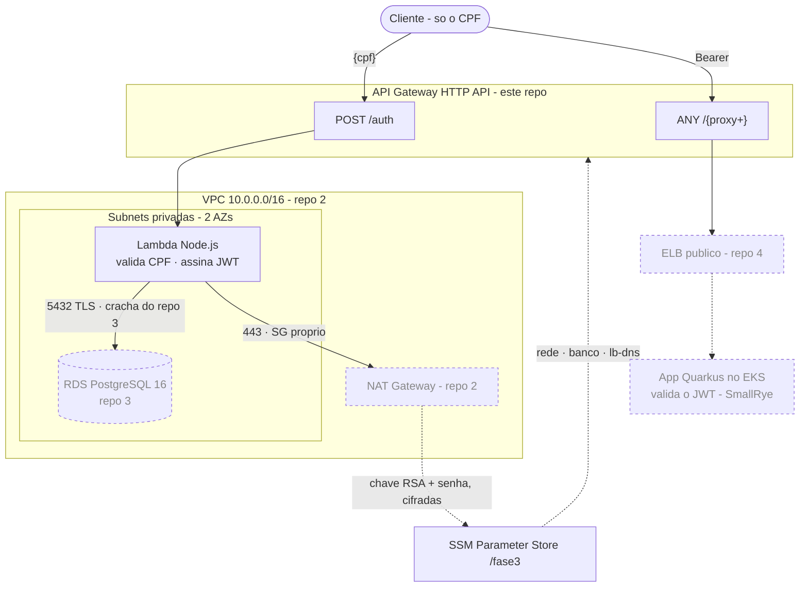

# fiap-fase3-auth-serverless — Lambda de autenticação por CPF + API Gateway (Terraform)

Repositório **1 de 4** do Tech Challenge Fase 3 (oficina mecânica → operação corporativa em nuvem).

```
2 · infra-k8s  ──►  3 · infra-db  ──►  4 · app  ──►  1 · auth-serverless
   VPC/EKS/ECR       RDS Postgres      Quarkus/EKS    (você está aqui)
```

É o **último** da ordem de deploy porque consome o contrato de todos os outros: rede e subnets do
repositório 2, credenciais do banco do 3 e o DNS do LoadBalancer do 4 — tudo pelo **SSM Parameter
Store**, sem nenhum ARN, endpoint ou DNS hardcodado.

> O sufixo `serverless` se refere à **Function Serverless** (o requisito do edital), **não** a um
> framework: o provisionamento é **Terraform**, igual aos outros três repositórios.

## O que este repositório entrega

O requisito central do desafio — o cliente se identifica **apenas pelo CPF** e recebe um token para
acompanhar suas ordens de serviço:

```
CPF ──► API Gateway (POST /auth) ──► Lambda ──► valida CPF ──► consulta RDS ──► assina JWT ──► token
                                                                                                │
        API Gateway (ANY /{proxy+}) ─────────────────► LoadBalancer do EKS ◄────── Bearer ───────┘
```

- **Lambda (Node.js)** — valida os dígitos verificadores do CPF, confirma que o cliente existe no
  banco e assina um JWT RSA com `groups=["CUSTOMER"]` e a claim `cpf`. A chave privada vem do SSM
  (`SecureString`) e é a **mesma** que a aplicação usa para validar — nenhuma chave no repositório.
- **API Gateway (HTTP API)** — expõe `POST /auth` para a Lambda e encaminha todo o restante do
  tráfego (`ANY /{proxy+}`) para a aplicação no EKS.

## Arquitetura

Linha cheia = provisionado por **este** repositório. Tracejado = criado por outros blocos.



### 🔴 O contrato do token

A aplicação **já valida** JWT com SmallRye e **não foi alterada** por este bloco. O token da Lambda
tem que ser aceito por essa validação como ela está:

| Configuração da app | Consequência aqui |
|---|---|
| `mp.jwt.verify.publickey.location` | assinamos com a **privada do mesmo par** (`/fase3/jwt/private-key`) |
| `mp.jwt.verify.issuer=https://oficina-api.com` | `iss` idêntico, byte a byte |
| `mp.jwt.verify.groups.path=groups` | os grupos vão na claim `groups`, como **array** |
| `mp.jwt.verify.audiences` **não configurada** | **não** emitimos `aud` — audiência que ninguém verifica só simula uma checagem |

O formato espelha o `JwtTokenAdapter` da app (`Jwt.claims().subject(...).issuer(...).groups(...)
.expiresIn(3600).sign()`). Resultado: **RS256** com `sub` = CPF, `iss`, `groups: ["CUSTOMER"]`,
`cpf`, `iat` e `exp` (+3600s).

### O acesso ao banco é por crachá, não por regra nova

O repositório 3 publica um security group vazio em `/fase3/rds/client-sg-id` que funciona como
**crachá**: quem o anexa alcança o RDS na 5432. A função anexa **dois** SGs — o crachá e um próprio,
criado aqui, com egress 443 para o SSM. Security groups são aditivos e a Lambda aceita até 5.

Isso existe para que este repositório **não precise criar uma regra dentro de um security group que
não é dele**. As alternativas eram liberar o CIDR inteiro da VPC ou o repo 1 mexer no SG do repo 3.

## Pré-requisitos

| Ferramenta | Versão | Observação |
|---|---|---|
| Terraform | **1.15.4** (`>= 1.11`) | `>= 1.11` por causa do lock nativo do backend S3 (`use_lockfile`) |
| Node.js | **20+** | empacotamento (`npm ci`) e testes (`node --test`, runner nativo) |
| AWS CLI | v2 | credenciais **temporárias** do Learner Lab (com `aws_session_token`) |
| Docker | qualquer | só para a verificação offline (sobe a app e um Postgres com TLS) |
| Repos 2, 3 e 4 aplicados | — | sem eles o `plan` falha com `ParameterNotFound` |

> **Não usamos o módulo `terraform-aws-modules/lambda/aws`.** Ele empacota chamando um script
> **Python** (inclusive no caminho com `build_in_docker`), e a máquina de desenvolvimento do projeto
> não tem Python. O empacotamento é `data "archive_file"` + `npm ci --omit=dev` — a alternativa que
> a decisão **F3** do plano já previa. Consequência prática na seção seguinte.

## Uso

### 1. Instalar as dependências da Lambda — **antes** de qualquer plan

```powershell
npm ci --omit=dev --prefix lambda
node --test tests/
```

🔴 **Não é opcional.** O `archive_file` empacota o que está **no disco** no momento do `plan`: sem
`node_modules`, o `apply` fica **verde** e a função quebra na primeira invocação com
`Cannot find module 'pg'`. O `preflight.ps1` reprova se faltar, e o workflow instala antes do
Terraform. Não há `devDependencies` — o runner de testes é o do próprio Node —, então
`--omit=dev` instala tudo o que os testes precisam.

### 2. Preflight — sempre, antes do apply

```powershell
.\scripts\preflight.ps1
```

Responde em segundos o que custaria uma sessão de laboratório: a sessão está viva? os repos 2, 3 e 4
publicaram o que este consome? **o `/fase3/eks/lb-dns` aponta para um LoadBalancer que existe**? o
zip vai sair com as dependências? **a `LabRole` consegue decifrar o SecureString da chave RSA**? E
imprime o `backend.hcl` pronto.

### 3. Aplicar

```powershell
Copy-Item backend.hcl.example backend.hcl      # e substitua <ACCOUNT_ID> (o preflight imprime)
terraform init "-backend-config=backend.hcl"   # as aspas importam no PowerShell
terraform plan                                 # 12 recursos, nada destruído
terraform apply                                # ~1-2 min
```

> **PowerShell:** sem aspas, o `-backend-config=backend.hcl` é quebrado no `=` e o Terraform recebe
> dois argumentos separados.

Nenhuma variável é obrigatória: tudo que varia por sessão chega pelo SSM. Este repositório **não tem
`terraform.tfvars`** — as variáveis de `variables.tf` existem para ajustar runtime, memória, TTL do
token e retenção de log.

## Contrato entre repositórios (SSM Parameter Store)

**Entrada** — lido por `data "aws_ssm_parameter"`. Este repositório **não publica nada**: é folha da
árvore de dependências.

| Parâmetro | Quem publica | Uso aqui |
|---|---|---|
| `/fase3/vpc/id` | repo 2 | VPC do security group próprio |
| `/fase3/vpc/private-subnets` | repo 2 | `vpc_config.subnet_ids` (StringList → CSV → `split`) |
| `/fase3/rds/endpoint` | repo 3 | `DB_HOST` — **host puro**, sem a porta |
| `/fase3/rds/port` · `db-name` · `username` | repo 3 | env vars da função |
| `/fase3/rds/client-sg-id` | repo 3 | **o crachá**, anexado às ENIs da função |
| `/fase3/rds/password` | repo 3 | **lido em runtime pela função**, não por `data` |
| `/fase3/jwt/private-key` | bootstrap manual | **lido em runtime pela função**, não por `data` |
| `/fase3/eks/lb-dns` | repo 4 (`cd.yml`) | `integration_uri` do `ANY /{proxy+}` |

### Por que os dois segredos não têm `data source`

Um `data "aws_ssm_parameter"` **materializa o valor decifrado no state**, em texto plano. A chave RSA
e a senha do banco chegam à função por leitura em runtime (`@aws-sdk/client-ssm`, uma chamada
`GetParameters` em batch, memoizada por container). Só o **nome** do parâmetro atravessa o Terraform,
como variável de ambiente.

Os valores **não-segredo** (host, porta, base, usuário) vão para o ambiente da função no `apply`:
não são secretos — estão visíveis no console da AWS —, e resolvê-los no apply evita duas chamadas de
rede em cada cold start.

### 🔴 `/fase3/eks/lb-dns`: o parâmetro que falha em silêncio

Ele é publicado pelo `cd.yml` do repo 4, por **nenhum Terraform**. Logo:

- **nenhum `destroy` o apaga** — ele sobrevive entre sessões do laboratório;
- ao recriar a infra, o valor antigo aponta para um ELB que **já morreu**;
- o `terraform apply` daqui **passa**, e o `ANY /{proxy+}` nasce devolvendo **503**.

O parâmetro **existir** faz parecer que está tudo certo, e o sintoma (503) não parece erro de
contrato. Por isso o `preflight.ps1` **e** o workflow conferem a data **e sondam o ELB de verdade**:

```powershell
aws ssm get-parameter --name /fase3/eks/lb-dns `
  --query "Parameter.[Value,LastModifiedDate]" --output text --region us-east-1
```

**Regra:** rode o `workflow_dispatch` do `cd.yml` no repo 4 **antes** do apply daqui. Ordem completa
de uma sessão: **2 → 3 → 4 → 1**.

## Verificação

### Offline — de graça, e é onde o risco real morre

O risco caro deste bloco não é nuvem: é o token ser recusado pelo SmallRye. Isso se prova **sem AWS**,
contra a aplicação no `docker compose`, por **US$ 0,00**. Os dois scripts abaixo separam três
problemas que, juntos, custam horas.

> ✅ **Os dois rodaram verdes ANTES do primeiro `apply`** (2026-09-02), junto de `node --test`
> (**21 testes**). Quando a infra subiu, o `apply` foi de primeira e os 5 casos do DoD passaram sem
> uma única iteração de depuração na nuvem — que é exatamente o que essa separação compra.

```powershell
.\scripts\verify-offline.ps1     # contrato do token contra a app real
.\scripts\verify-tls-probe.ps1   # o caminho TLS do `pg`, que o teste acima nao exercita
```

`verify-offline.ps1` sobe a app, **confere que a chave privada do SSM é o par da pública que a app
valida** (sem isso o teste rodaria sobre chaves diferentes e não provaria nada), roda o **handler
real** da Lambda contra o Postgres do compose e joga o token na aplicação:

| Chamada | Esperado | O que prova |
|---|---|---|
| `GET /tracking/1` **sem** token | **401** | a rota está protegida |
| `GET /tracking/1` **com** o token | **404** `Work Order not found` | **token ACEITO** — assinatura, `iss` e `groups` passaram. 401 seria recusa; 403, grupo errado |
| admin cria uma OS → `GET /tracking/{id}` com o token | **200** | o 200 do Definition of Done, sem nuvem |

> ⚠️ **O seed do `V1.0.0__oficina.sql` não tem `work_orders`** — nem local, nem no RDS. Sem criar uma
> ordem de serviço, `/tracking/{id}` devolve 404 para sempre e o DoD parece não fechar. O script cria
> (`customer_id=2` / `vehicle_id=2` são o par semeado da Maria Santos, dona do CPF do caminho feliz).

`verify-tls-probe.ps1` fecha o buraco que o primeiro deixa: como o Postgres do compose não exige TLS,
o teste acima roda com `DB_SSL=disable` e **não exercita** o caminho que falha na nuvem. A sonda sobe
um Postgres descartável que se comporta como o RDS (`ssl=on` + `pg_hba` **só com `hostssl`**) e prova
as duas direções — `disable` recusado com a mensagem literal do RDS, `require` conectando.

### Na nuvem — Definition of Done

> **Executado de ponta a ponta em 2026-09-02** na conta do lab: `fmt -check`/`validate` OK ·
> `plan` = **12 to add** · `apply` = **12 added, 0 changed, 0 destroyed** (a função em 3m58s — o
> tempo é a ENI na VPC, não o zip) · os **5 casos** da matriz abaixo com o status esperado, **todos
> pelo API Gateway**.
>
> Evidências que o `curl` sozinho não mostra:
>
> | O que | Medido |
> |---|---|
> | Execution role | `arn:aws:iam::877240481212:role/LabRole` — **nenhuma IAM role criada** (F1) |
> | Rede | as 2 subnets privadas + **os 2 SGs**: o próprio (443) e o crachá `sg-0ee14…` do repo 3 |
> | Leitura cifrada do SSM como LabRole | **zero `AccessDenied`** no log da função |
> | Cache dos segredos e do pool | cold start **890 ms** → invocação quente **5,8 ms** |
> | Memória | 111 MB de 256 (128 MB seria apertado com o SDK carregado) |
> | Claims emitidas | `{"sub","iss":"https://oficina-api.com","groups":["CUSTOMER"],"cpf","iat","exp"}`, `exp−iat = 3600`, **sem `aud`** |
> | Log da função | CPF **mascarado** (`*********00`), nunca o documento cheio |
> | Access log da stage | as duas rotas registradas: `POST /auth` e `ANY /{proxy+}` |
> | `X-Trace-Id` do cliente | `EVIDENCIA-5-1` **atravessa o Gateway intacto** e volta na resposta — a decisão de não carimbar preserva a correlação dos Blocos 4b–4e |

```powershell
$api = terraform output -raw api_endpoint

# 1. caminho feliz -> 200 com JWT
curl.exe -s -X POST "$api/auth" -H "content-type: application/json" -d '{"cpf":"98765432100"}'

# 2. o token numa rota protegida, PELO GATEWAY -> 200
curl.exe -s -o NUL -w "%{http_code}`n" "$api/carworkshop/v1/tracking/1" -H "Authorization: Bearer <token>"

# 3. sem token -> 401
curl.exe -s -o NUL -w "%{http_code}`n" "$api/carworkshop/v1/tracking/1"

# 4. CPF valido, cliente inexistente -> 404
curl.exe -s -X POST "$api/auth" -H "content-type: application/json" -d '{"cpf":"11144477735"}'

# 5. digitos verificadores invalidos -> 400
curl.exe -s -X POST "$api/auth" -H "content-type: application/json" -d '{"cpf":"12345678901"}'
```

> ⚠️ **No PowerShell, `curl` é alias de `Invoke-WebRequest`** — use `curl.exe`. E o PS 5.1 **remove
> as aspas duplas** ao passar argumentos para executável nativo: `-d '{"cpf":"..."}'` chega ao curl
> como `{cpf:...}` e a Lambda responde 400. Para corpos JSON, escreva num arquivo e use
> `-d "@arquivo.json"` (é o que o `verify-offline.ps1` faz).

🔴 **Os CPFs do seed são uma armadilha.** Os três clientes foram inseridos por SQL, contornando o
validador do domínio — então **dois dos três têm dígitos verificadores inválidos**:

| CPF | Cliente | Dígitos válidos? | Serve para |
|---|---|---|---|
| `98765432100` | Maria Santos | ✅ | **caminho feliz** → 200 |
| `12345678901` | John Silva | ❌ | CPF inválido → 400 |
| `11122233344` | Carlos Oliveira | ❌ | idem |
| `11144477735` | — | ✅, mas não existe | cliente inexistente → 404 |

Tentar o caminho feliz com o CPF do "John Silva" devolve 400 e manda você caçar um bug que não existe.

## Custo e destruição

| Item | Custo |
|---|---|
| Lambda (requisições + GB-s) | **US$ 0,00** na prática — o free tier cobre 1M req/mês |
| API Gateway HTTP API | ~US$ 1,00 por milhão de requisições |
| CloudWatch Logs (7 dias de retenção) | centavos |
| **Este repositório, ligado** | **~US$ 0,00/dia** |

Diferente dos repos 2 e 3, **nada aqui fatura por hora**: não há control plane, instância nem NAT.
Ainda assim, `destroy` na ordem: o `{proxy+}` aponta para um ELB que vai deixar de existir.

**Ordem de destruição entre repos: 1 → 4 → 3 → 2.**

```powershell
terraform destroy      # segundos
```

⚠️ **Antes do destroy do repo 2:** `kubectl -n car-workshop delete svc car-workshop-api` — o ELB deixa
uma ENI na subnet e trava a destruição da VPC.

## Decisões (resumo — detalhamento nos RFCs/ADRs do Bloco 7)

| Decisão | Motivo |
|---|---|
| `archive_file` + `npm ci` em vez do módulo `terraform-aws-modules/lambda/aws` | o módulo empacota via script Python, ausente na máquina do projeto. Previsto em F3 |
| Segredos lidos em **runtime**, não por `data source` | um `data "aws_ssm_parameter"` materializa o valor decifrado no state, em texto plano |
| Não-segredos como **env var resolvida no apply** | host e porta não são secretos, e resolvê-los no apply poupa chamadas de rede no cold start |
| Acesso ao RDS por **crachá** (`/fase3/rds/client-sg-id`) | nenhum repositório precisa criar recurso dentro de outro; regra mínima, sem abrir o CIDR da VPC |
| SG próprio **além** do crachá | o crachá é restrito à 5432; a função também precisa de 443 para o SSM. SGs são aditivos |
| `ssl: { rejectUnauthorized: false }` no `pg` | é o equivalente exato do `?sslmode=require` da app: os dois cifram, nenhum verifica a CA. Verificar exigiria embutir o bundle da AWS, e `*.pem` é gitignored aqui |
| CPF **sem** normalizar pontuação | o validador da app exige `^\d{11}$` e a coluna guarda 11 dígitos crus; aceitar `529.982.247-25` criaria dois contratos diferentes no mesmo sistema |
| **404** (não 401) para cliente inexistente | nada foi recusado por falta de credencial — o recurso é que não existe |
| **400** (não 404) para CPF com dígitos inválidos | responder "não encontrado" a um CPF impossível transformaria o endpoint num oráculo de quem está cadastrado |
| `reserved_concurrent_executions` **não** setado | a AWS recusa reserva que deixe a concorrência não-reservada da conta abaixo de **100**, e o teto do lab é 10 — nenhuma reserva é possível |
| Log group **explícito** | sem ele a Lambda cria um com retenção infinita que o `destroy` não remove |
| **Sem** carimbar `X-Trace-Id` na borda | `overwrite` apagaria o header do cliente e `append` produziria `id-cliente,id-gateway`; o id de fora atravessar intacto é a base da correlação provada nos Blocos 4b–4e. O id do Gateway fica no access log |
| Stage `$default` com `auto_deploy` | ambiente único (F4): não há promoção entre stages, e a URL sai sem prefixo |
| HTTP API, não REST API | mais barato, sobe em segundos e não exige a role de CloudWatch no nível da conta, que o Learner Lab não deixaria criar |
| `nonsensitive()` nos parâmetros lidos | o provider marca todo `aws_ssm_parameter` como sensitive, e sem isso o `plan` esconde o `integration_uri` e o `DB_HOST` — os campos que a revisão de um plan precisa ver |

## Troubleshooting

| Sintoma | Causa provável / solução |
|---|---|
| `plan` falha com **`ParameterNotFound`** | um repositório anterior não está aplicado. Ordem: 2 → 3 → 4 → 1 |
| `POST /auth` → **500** e o log da função mostra `Cannot find module 'pg'` | o zip subiu sem dependências: `npm ci --omit=dev --prefix lambda` e reaplique |
| `POST /auth` → **500** e `AccessDeniedException` no CloudWatch | a execution role não decifra o SecureString. Confirme com o passo 5 do preflight. **Plano B:** passar a chave por env var da função (o `config.mjs` já aceita `JWT_PRIVATE_KEY`), registrando a divergência |
| `POST /auth` → **500** e a função dá **timeout** | não é permissão, é rota: a função está em subnet privada e depende do NAT. Confirme `enable_nat_gateway = true` no repo 2 |
| `POST /auth` → 500 com `no pg_hba.conf entry ... no encryption` | `DB_SSL` chegou como `disable`. O RDS tem `rds.force_ssl = 1` |
| `ANY /{proxy+}` → **503** | `/fase3/eks/lb-dns` obsoleto. Rode o `workflow_dispatch` do `cd.yml` no repo 4 e reaplique daqui |
| `POST /auth` → **400** onde você esperava 200 | o CPF. Use `98765432100`; `12345678901` é semeado **inválido**. E no PS 5.1 confira o quoting do `-d` |
| `POST /auth` → 403/500 sem log nenhum na função | falta o `aws_lambda_permission` — o Gateway não consegue invocar |
| `apply` falha com **`runtime is no longer supported`** | a AWS bloqueou a criação nesse runtime: ajuste `lambda_runtime` |
| `apply` falha com `Insufficient permissions to enable logging` | o lab negou o access log da stage: `enable_access_logs = false` |
| `apply` falha com **`ResourceAlreadyExistsException`** no log group | sobrou de um apply anterior sem destroy: `aws logs delete-log-group --log-group-name /aws/lambda/fiap-fase3-auth` |
| `Output refers to sensitive values` | um `aws_ssm_parameter` novo sem `nonsensitive()` em `locals.tf` |
| `terraform init/plan` com erro **x509** | interceptação TLS local (antivírus com HTTPS scanning). Desligue o scan de HTTPS |
| `ExpiredToken` / `InvalidClientTokenId` | sessão do lab expirou (~4h). Renove e recole os 3 GitHub Secrets |
| `Error acquiring the state lock` | dois runs simultâneos (o `concurrency` do workflow evita) **ou** lock preso: `aws s3 cp s3://<bucket>/auth-serverless/terraform.tfstate.tflock -` para achar o ID e `terraform force-unlock <ID>`. ⚠️ Antes de forçar, confira se não há apply em curso: o `CreateFunction` da Lambda retorna em segundos com `State=Pending` e o Terraform espera a ENI da VPC ~4 min — nesse intervalo o state parece vazio e o apply parece morto |
| `plan` insiste em `1 to change` no `source_code_hash` | o `archive_file` embute o modo dos arquivos no zip, e Windows dá 0666 onde Linux dá 0644: **o mesmo código gera hashes diferentes** entre a máquina local e o runner. É benigno (a função é republicada em segundos), mas alternar apply local e apply do CI nunca dá "No changes" |
| `verify-offline.ps1`: **conflito de nome de container** | sobraram containers paradas do projeto `fiapchallenge` (Fase 2), que fixam `oficina_app`/`oficina_db`. Remova-as ou suba com `-p <projeto>` e um override de `container_name` |
| `NativeCommandError` no meio de um script `.ps1` | stderr informativo de executável nativo com `$ErrorActionPreference = 'Stop'`. Use os helpers `Invoke-Probe` / `Invoke-Native` |

## CI/CD

| Gatilho | O que roda |
|---|---|
| `pull_request` → `main` | `npm ci` → `node --test` → `fmt -check` → `init` → `validate` → `plan` (**nunca aplica**) |
| `push` → `main` (merge do PR) | idem + `apply -auto-approve` + smoke test da borda |
| `workflow_dispatch` | `plan` \| `apply` \| `destroy` |

Antes do Terraform o workflow confere o contrato dos repos 2, 3 e 4 e **sonda o ELB**, com mensagem
apontando quem publica o que falta. Depois do `apply`, o smoke test prova que a borda responde:
`POST /auth` com CPF inválido → **400** (o Gateway roteou e a Lambda executou) e
`GET /tracking/1` sem token → **401** (o `{proxy+}` alcançou a app viva; 503 seria o `lb-dns` velho).

Os 3 secrets do laboratório (`AWS_ACCESS_KEY_ID`, `AWS_SECRET_ACCESS_KEY`, **`AWS_SESSION_TOKEN`**) e
a variável `TF_STATE_BUCKET` são de **repositório** — secret de *Environment* não chega a este
workflow, que não declara `environment:`. Eles rotacionam a cada sessão do lab (~4h) e são cópias
independentes do `~/.aws/credentials`: atualizar o arquivo local **não** atualiza o GitHub.

> ⚠️ **Não marque este workflow como status check obrigatório** no ruleset: ele depende da credencial
> temporária do laboratório e travaria todo merge feito fora do horário do lab.
